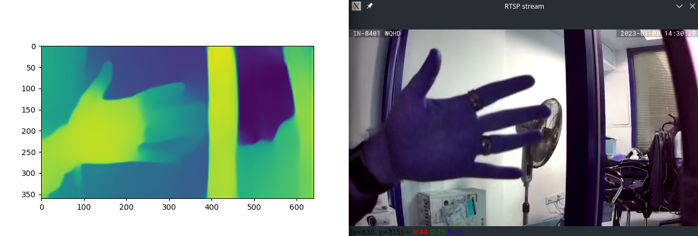

# MiDaS Depth Vision

> MiDaS - see [Towards Robust Monocular Depth Estimation: Mixing Datasets for Zero-shot Cross-dataset Transfer](https://arxiv.org/abs/1907.01341) by René Ranftl, Katrin Lasinger, David Hafner, Konrad Schindler, Vladlen Koltun - computes relative inverse depth from a single image. The repository provides multiple models that cover different use cases ranging from a small, high-speed model to a very large model that provide the highest accuracy. The models have been trained on 10 distinct datasets using multi-objective optimization to ensure high quality on a wide range of inputs. 

